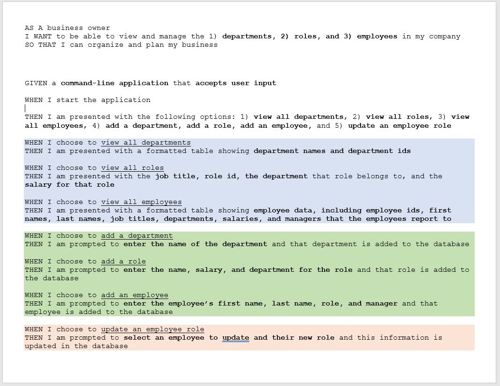
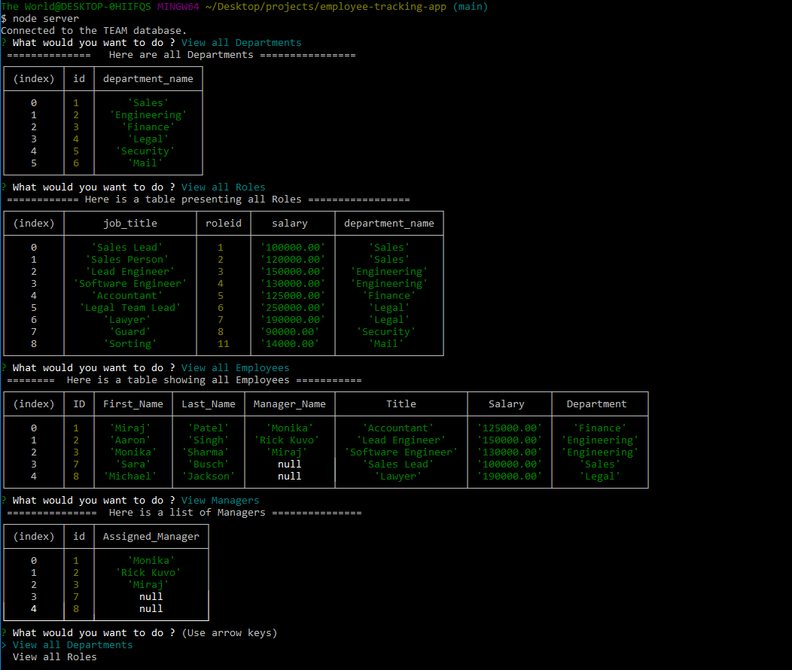

# employee-tracking-app

## Description :

Employee-tracking-App is command-line based application. It uses SQL databse and provides team worker's data in table format. It allows to View, Delete, Add and Update Employee, Department, Role and Manager data.

```
* The requirement from the client include as below :
```


## Languages and other components used : 
```
   * Node.js 
   * npm (node package manager) 
   * Expess.js server ( Node based web server ) 
   * MySQL (Structured Query Language)
   * Database Queries with SELECT, INSERT, DELETE and UPDATE 
   * Inquirer npm 
   * MySQL2 
```

## How to install : 
 ```
 To install the application in your computer follow the steps below: 

 1. Clone the repository in your computer :
    - open the command line and go to the directory where you want to clone the repository.
    - then clone the repo by typing : " git@github.com:miraj00/employee-tracking-app.git "

 2. Install MySQL in your computer. 

 3. Install node.js on your computer by going to https://nodejs.org/en/  
  
 4. Once node.js is installed, type "npm init" on the cammand line Terminal at root directory.
    - This will initiate npm packages

 5. Create Express.js server by typing : "npm install express" on the command line

 6. Install MySQL2 by typing : " npm install --save mysql2 " in command line

 7. You can use " mysql -u root -p " to start MySQL Server 

 8. Once SQL is on, type : " source db/schema.sql; " and then " source db/seeds.sql " 

 9.  You can use " exit " or " Quit " to stop the server anytime

 10. Note : Since we have connection.js file to connect to SQL database, we may not need to turn on SQL database.

 11. Once above steps are done, On Command Prompt at root directory type : " node server.js " to initiate application
```
## Demo video Link (inclueds Video under link as well) of How to use the application available at  : 
```
https://drive.google.com/file/d/1q2y0YXAkWzJ_kW2t4IjRvjmx8kyOC0tg/view

```

https://user-images.githubusercontent.com/84084583/132161438-61081242-2f1a-48f1-9fb6-e6467c4dda63.mp4


## Below is the screenshot and Deployed application of the Project as per client request ## 




[Please click here to deploy application in Github](https://github.com/miraj00/employee-tracking-app)
